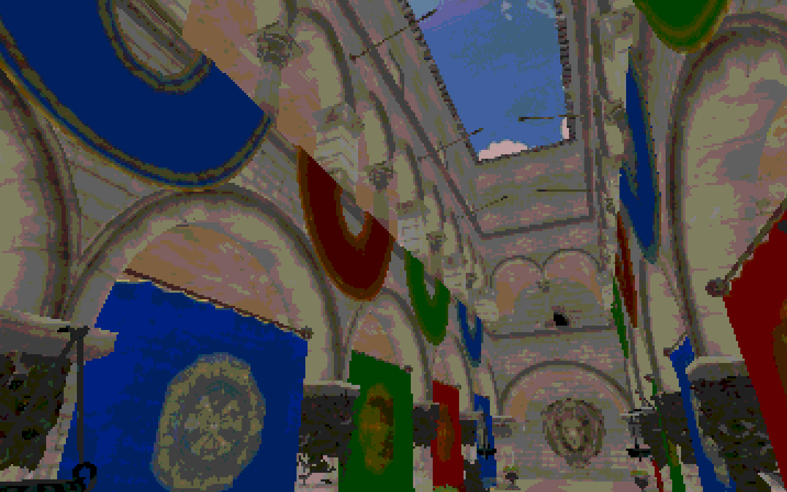

<div align="center">
   
  <h1 style="font-size: 3rem; margin-top: 10px;"><strong>Origin Engine</strong></h1>
</div>

**Important Links (Under Construction!):**

* **[Origin Website](https://origin.aloyak.dev)**
* **[Demo Game](https://origin.aloyak.dev/game)**

## General Information
Origin is a true 3D pixel-art game engine written from scratch in modern C++. It uses OpenGL for rendering and is designed to be cross-platform, supporting Windows, macOS, Linux, and the Web. Web builds are enabled through WebAssembly using Emscripten.

## Screenshot


> Origin Engine 0.7 running on Linux. You can see a simple scene with the sponza model and a simple skybox.

## Building

The project uses **CMake** to generate and build the engine. The repository is organized into three main modules:

* `engine` — the core engine code
* `game` — the game project that uses the engine
* `sandbox` **(not yet!)** — planned map editor with extra features

You may want to change your game's name in `game/CMakeLists.txt`.

* **Requirement:** CMake **3.23 or newer**.

* Note that the `sponza` model is **not included**. You can download it with `assets/models/download-sponza.sh` or clone it yourself from https://github.com/jimmiebergmann/Sponza

### Linux

To build the project on Linux:

```sh
chmod +x ./build.sh
./build.sh
```

This script will generate a build directory and compile the project.
The final executable can be found in `build/game/`

### Web

* **Requirement:** Emscripten sdk must be installed!

* Note that the web build is based on a minimal template static page at `game/web/shell.html` that you can modify as you like

```sh
chmod +x ./build.sh 
./build.sh --web

python3 -m http.server 8080 --directory build-web/game/ # suggestion!
```

* Mouse Input seems to be broken on Brave

This script will generate a build directory specific for web and compile the project.
Your build can be found at `build-web/game/game.html`, it should be opened with a server in order to work!

### Other Platforms

Support for other platforms is supported but currently limited:

* Windows — not yet tested (recommended using Visual Studio to build)
* macOS — not yet tested (origin uses OpenGL 4.1 as it is the last supported openGL version for MacOS, but **it is officially deprecated!**)

## License

This project is under the MIT License. Please see `LICENSE.md` for more information!