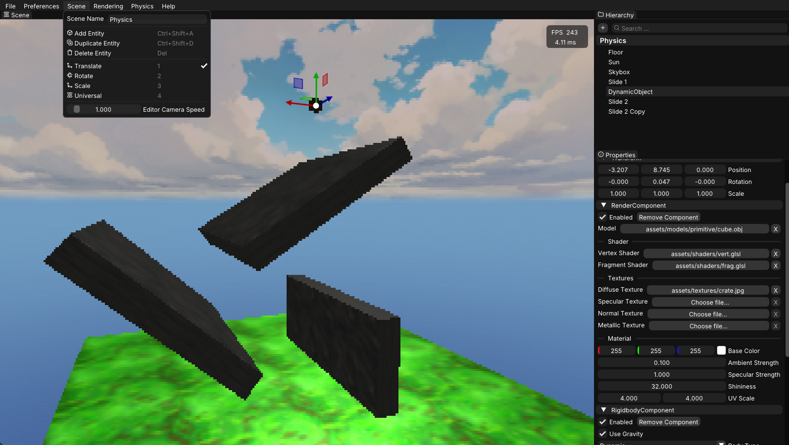

<div align="center">
   
  <h1 style="font-size: 3rem; margin-top: 10px;"><strong>Origin Engine</strong></h1>
</div>

* **[Origin Website](https://origin.aloyak.dev)**
* **[Demo Game](https://origin.aloyak.dev/game)**

## General Information
The origin engine is a 3D pixel-art lightweight game engine written in modern C++. It uses OpenGL 4.6 as the graphics backend. It handles rendering, physics, audio, input as well as many different other builtin systems and features

Apart from that, the engine ships with a sandbox level editor that allows you to create and edit your own levels that the game might use

The physics layer abstracts Bullet3 physics engine to provide a simple and easy to use interface for the user. The engine also provides tools for spatial audio, supports many 3d model formats and compiles shaders at runtime!

## Showcase


> Origin Engine 0.12.0 running on Linux. You can see a simple scene with the sponza model, a player with a camera component, and a dynamic point light.



> Sandbox Editor running on Linux. Featuring the physics playground scene.

## Building

The project uses **CMake** to generate and build the engine. The repository is organized into three main modules:

* `engine` core engine code, holds the basic systems like rendering, physics, audio, input, window...
* `game` the game project that uses the engine, contains the game logic and assets
* `sandbox` works as any other game project, but includes the an imgui layer and many features to edit and create levels/scenes!

You may want to change your game's name in `game/CMakeLists.txt`.

* **Requirement:** CMake **3.23 or newer**. Cmake 4.0+ is **not completely supported**. 

* Note that the `sponza` model is **not included**. You can download it with `assets/models/download-sponza.sh` or clone it yourself from https://github.com/jimmiebergmann/Sponza

### Linux

To build the project on Linux:

```sh
chmod +x ./build.sh
./build.sh

# If you don't want to build the sandbox:
./build.sh --no-sandbox
```

This script will generate a build directory and compile the project.
The final executable can be found in `build/game/`

### Windows

To build the project on Windows, you can use the same `build.sh` script if you have a compatible environment (like Git Bash or WSL). Alternatively, you can use CMake directly:

* Tested using ninja but Visual Studio should work as well (recommended even!)

* This can also be done from linux using a cross-compiler toolchain!

```sh
mkdir build
cd build
cmake -G "Ninja" .. # or -G "Visual Studio 17 2021" 
ninja
```

### Web

* **Requirement:** Emscripten sdk must be installed!

* Note that the web build is based on a minimal template static page at `game/web/shell.html` that you can modify as you like

```sh
chmod +x ./build.sh 
./build.sh --web # Sandbox isn't built for web
```
```sh
python3 -m http.server 8080 --directory build-web/game/ # suggestion!
```

This script will generate a build directory specific for web and compile the project.
Your build can be found at `build-web/game/game.html`, it should be opened with a server in order to work!

### MacOS

* Not yet tested! (origin uses OpenGL 4.1 as it is the last supported openGL version for MacOS, but **it is officially deprecated!**)

## License

This project is under the MIT License. Please see `LICENSE.md` for more information!

## Thanks and Inspirations
* [LearnOpenGL](https://learnopengl.com/) - the best OpenGL tutorial website out there
* [Texel-Splatting](https://dylanebert.com/texel-splatting/) by [Dylan Ebert](https://github.com/dylanebert) - gave me the idea to create this engine in the first place
* [Lite Engine](https://github.com/maritim/LiteEngine) - introduced me to game engines a while back, used then to test and try stuff

### HackClub

<a href="https://hackclub.com/"></a>

Proud member of [Hack Club](https://hackclub.com/)!

This project was made as part of HackClub's Flavortown Event (2026): <https://flavortown.hackclub.com/projects/14868>